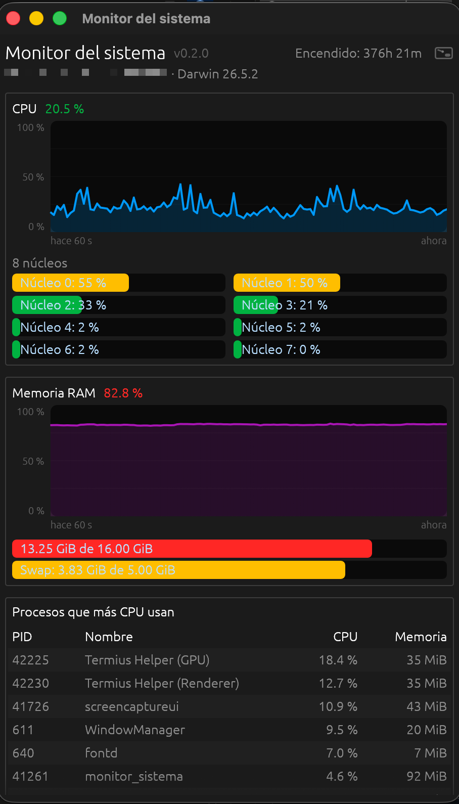
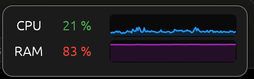

# Monitor del sistema (Rust + egui)

Muestra en tiempo real: uso de CPU (gráfica + por núcleo), memoria RAM/swap y los procesos que más CPU consumen.

<p align="center">
  
</p>

## Descargar

Descarga la última versión desde [Releases](https://github.com/soporte605/monitor_sistema/releases/latest):

| Sistema | Archivo |
|---|---|
| macOS (Apple Silicon e Intel) | `monitor_sistema-vX.Y.Z-macos.zip` |
| Windows | `monitor_sistema-vX.Y.Z-windows.zip` |
| Linux (x86_64) | `monitor_sistema-vX.Y.Z-linux-x86_64.tar.gz` |

La app no está firmada por Apple ni por Microsoft, así que la primera vez el sistema avisará:

- **macOS:** descomprime el `.zip`, mueve **Monitor del sistema** a Aplicaciones y ábrelo. Si macOS dice que no puede comprobar el desarrollador, ve a **Ajustes del Sistema → Privacidad y seguridad** y pulsa **Abrir igualmente**. También puedes quitar la marca de cuarentena desde la terminal:
  `xattr -dr com.apple.quarantine "/Applications/Monitor del sistema.app"`
- **Windows:** descomprime el `.zip` y ejecuta `monitor_sistema.exe`. Si aparece SmartScreen, pulsa **Más información → Ejecutar de todas formas**.
- **Linux:** descomprime con `tar -xzf monitor_sistema-*.tar.gz` y ejecuta `./monitor_sistema`.

## Uso

### Ventana completa
Muestra el uso de CPU global con su gráfica del último minuto, las barras de cada núcleo, la memoria RAM y swap con su gráfica, y una tabla con los 8 procesos que más CPU consumen. Pasa el ratón sobre un nombre recortado para verlo completo.

### Modo compacto
Un widget pequeño, sin barra de título y **siempre visible** encima de las demás ventanas, con el uso de CPU y RAM y sus mini gráficas.

<p align="center">
  
</p>

| Acción | Cómo |
|---|---|
| Entrar al modo compacto | Icono de "imagen en imagen" arriba a la derecha, o **⌘⇧M** (macOS) / **Ctrl+Shift+M** (Windows y Linux) |
| Mover el widget | Arrástralo desde cualquier punto |
| Volver a la ventana completa | Doble clic, el icono que aparece al pasar el ratón, o el mismo atajo |

La ventana vuelve con su tamaño y posición anteriores, y el widget recuerda dónde lo dejaste mientras la app siga abierta.

> En Linux con Wayland, algunos gestores de ventanas ignoran la opción "siempre visible".

## Compilar desde el código
1. Instala Rust: https://rustup.rs
2. En esta carpeta: `cargo run --release`

Dependencias: `eframe` (ventana y GUI) y `sysinfo` (datos del sistema). Funciona en Windows, macOS y Linux.

## Flujo de trabajo

### Ramas
- `main`: solo versiones publicadas. Cada versión lleva un tag `vX.Y.Z`. Sin commits directos.
- `develop`: integración del trabajo en curso. Sin commits directos; todo entra por Pull Request.
- `feature/<nombre>`, `fix/<nombre>`, `chore/<nombre>`, `docs/<nombre>`: una rama por cambio, creada desde `develop` y fusionada de vuelta con un Pull Request hacia `develop`.

### Antes de cada commit
```bash
cargo fmt                   # formatear
cargo clippy --all-targets  # sin advertencias nuevas
cargo test                  # tests de las funciones puras
cargo build                 # compilación limpia
```

Todo cambio visible para el usuario se anota en `CHANGELOG.md`, sección `[Sin publicar]`, en el mismo PR que lo introduce.

### Versionado semántico
La versión vive en `Cargo.toml` (`version = "X.Y.Z"`) y se muestra en la app.
- **MAJOR**: cambios incompatibles.
- **MINOR**: funcionalidades nuevas compatibles.
- **PATCH**: correcciones.

Mientras la versión sea `0.x`, el proyecto está en desarrollo inicial.

### Commits
Se usa [Conventional Commits](https://www.conventionalcommits.org/es/v1.0.0/): `feat:`, `fix:`, `docs:`, `refactor:`, `chore:`…

### Publicar una versión
1. Crear la rama `chore/release-vX.Y.Z` desde `develop`.
2. En `CHANGELOG.md`, mover lo de `[Sin publicar]` a `## [X.Y.Z] - AAAA-MM-DD` y actualizar los enlaces del final.
3. Actualizar `version` en `Cargo.toml` y ejecutar `cargo build` (actualiza `Cargo.lock`).
4. Commit `chore(release): vX.Y.Z` y Pull Request hacia `develop`.
5. Tras fusionarlo, avanzar `main` hasta `develop` y crear el tag anotado:
   ```bash
   git checkout main && git merge --ff-only develop
   git tag -a vX.Y.Z -m "vX.Y.Z"
   git push origin main vX.Y.Z
   ```
6. Al subir el tag, GitHub Actions ([`release.yml`](.github/workflows/release.yml)) compila la app y crea la Release. Comprobar que el workflow termina bien:
   ```bash
   gh run watch
   ```

### Qué hace el workflow de Release
| Trabajo | Resultado |
|---|---|
| macOS | Compila para Apple Silicon e Intel, los une con `lipo` en una `.app` universal, la firma ad hoc (sin firma no arranca en Apple Silicon) y la empaqueta en `.zip` |
| Windows | `.exe` en `.zip` junto a `LICENSE` y `README.md` |
| Linux | Binario x86_64 en `.tar.gz` junto a `LICENSE` y `README.md` |
| Publicar | Crea la Release con los tres archivos y usa como notas la sección de esa versión del CHANGELOG |

La app no tiene firma de desarrollador de Apple ni de Microsoft; por eso la sección [Descargar](#descargar) explica cómo abrirla la primera vez.

## Licencia

[MIT](LICENSE)
